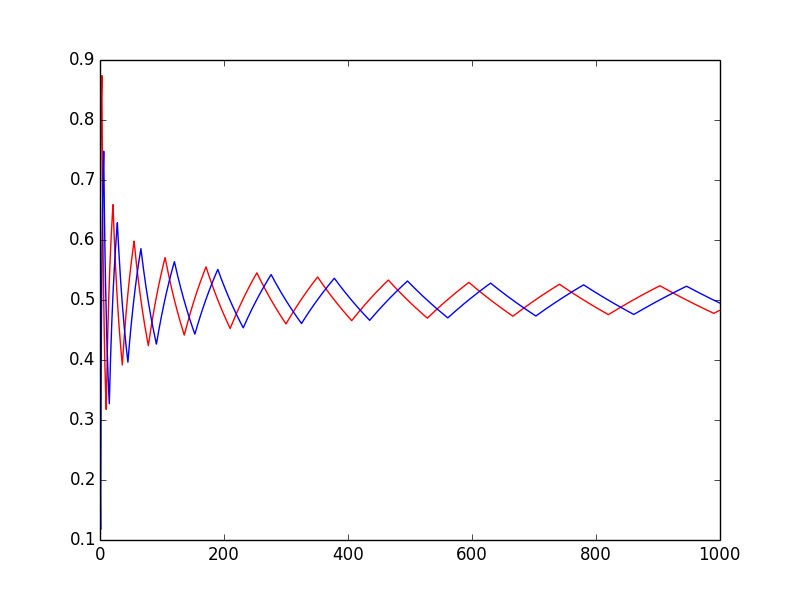
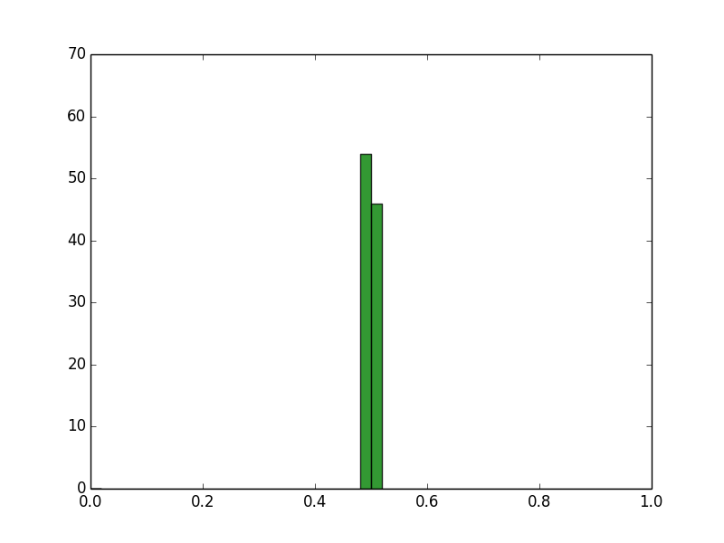
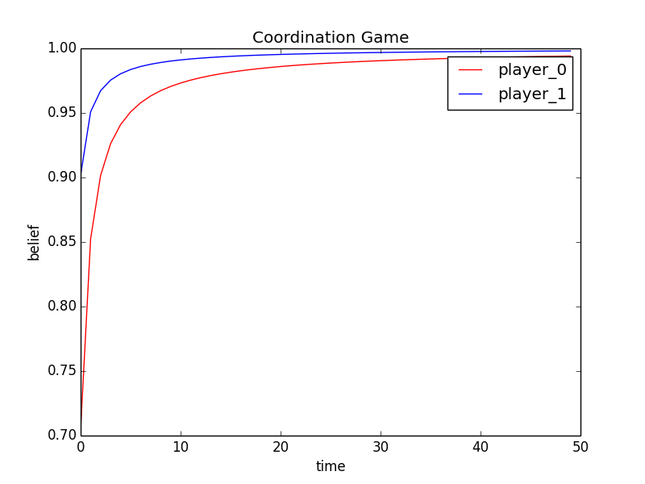
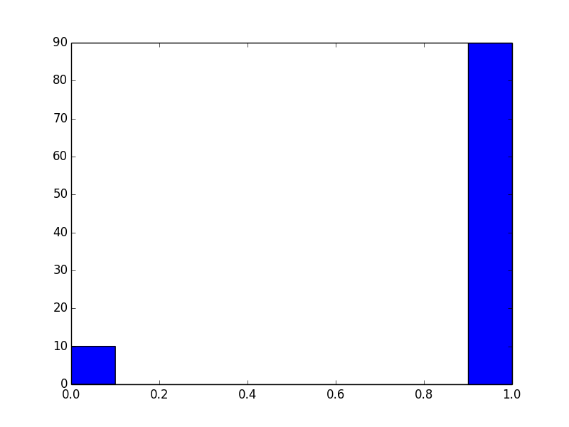

Fictitious play
========

Matching Penniesのプログラムの出力結果です：

調整ゲームのプログラムの出力結果です：

[背景とコードの説明](https://docs.google.com/viewer?url=https://github.com/yoshimasaogawa/fictitiousplay/blob/master/fictplay.pdf?raw=true)